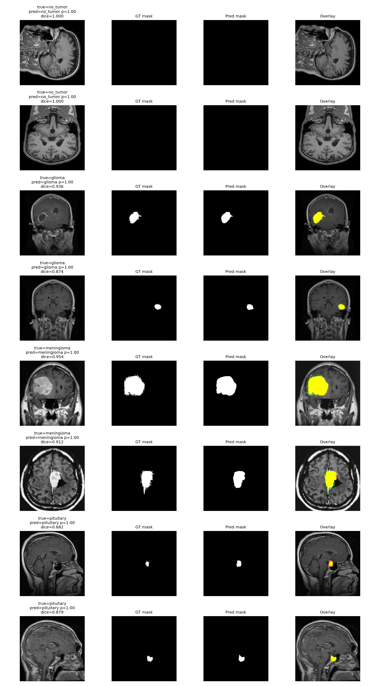
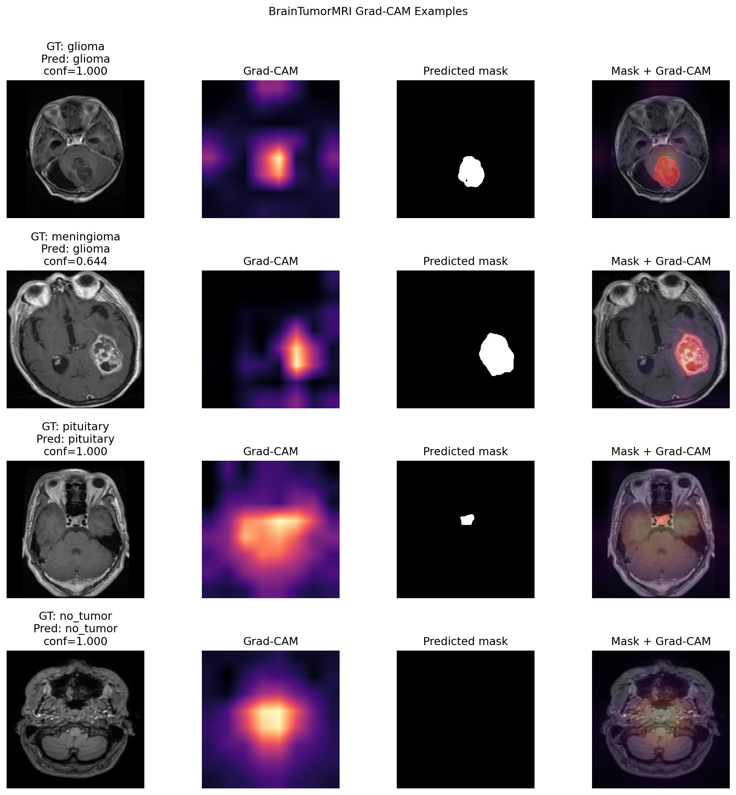
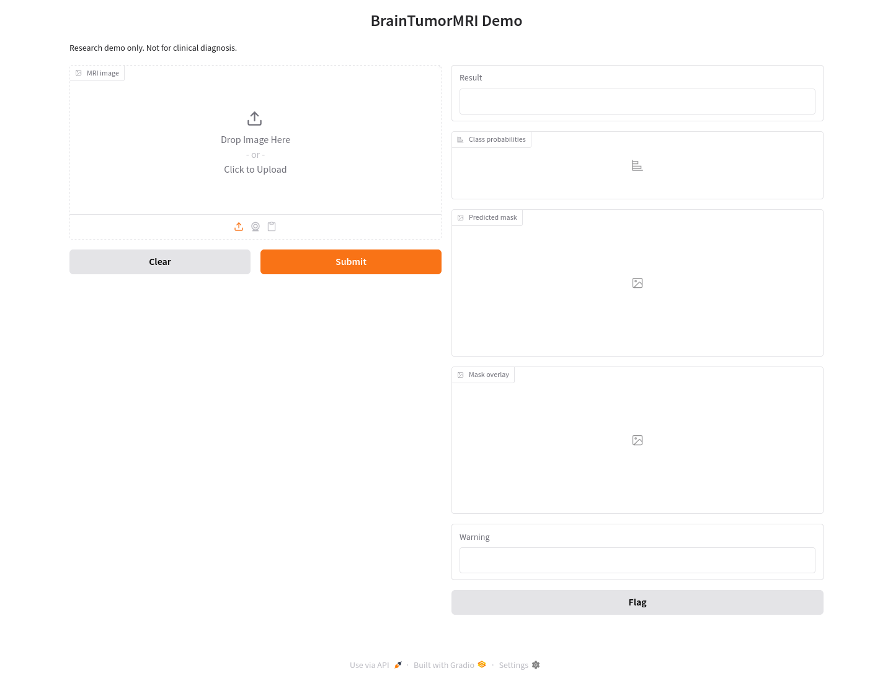

# BrainTumorMRI


BrainTumorMRI trains a PyTorch + MONAI multitask model on the BRISC 2025 brain MRI dataset:

- Classification: 4 classes, `no_tumor`, `glioma`, `meningioma`, `pituitary`
- Detection: derived binary output from the classification head, tumor vs no tumor
- Segmentation: binary tumor mask from the segmentation decoder

Project documentation:

- [Model Card](MODEL_CARD.md)
- [Dataset Card](DATASET_CARD.md)
- [Analysis Report](reports/report.md)

Dataset source: <https://www.kaggle.com/datasets/briscdataset/brisc2025>

## Model Choice

The current practical headline model is **ConvNeXt-Tiny MTL**: a shared ConvNeXt-Tiny encoder with a classification
head and a U-Net style segmentation decoder.

ConvNeXt-Tiny is used as the headline model because it provides the best classification and binary detection results
while keeping inference lighter. ConvNeXt-Base remains useful when segmentation Dice is the main priority.

- ConvNeXt-Tiny is the current practical default for this repository.
- The shared encoder learns tumor morphology once, then serves both class prediction and mask prediction.
- U-Net style skip connections preserve spatial detail for masks, which is important for medical segmentation boundaries.
- It is easier to train and debug than Swin-UNETR while still being strong enough for BRISC scale.

Current headline result on the official BRISC test split:

- 4-class classification accuracy: 0.9940
- Binary tumor detection accuracy: 1.0000
- Segmentation Dice: 0.8387
- Segmentation IoU: 0.7814
- ECE: 0.0055

## Environment

Create the conda environment:

```bash
conda env create -f environment.yml
conda activate brain-tumor-mri
```

If you already created the environment and changed dependencies:

```bash
conda env update -f environment.yml --prune
conda activate brain-tumor-mri
```

The project uses `pyproject.toml` for Python package metadata and dependencies. PyTorch and CUDA are installed through conda because that is more reliable than resolving GPU wheels through pip.

## Download Data

Download the Kaggle dataset:

```bash
python scripts/download_dataset.py --copy --out data/brisc2025
```

Or use the Kaggle cache path printed by:

```python
import kagglehub

path = kagglehub.dataset_download("briscdataset/brisc2025")
print("Path to dataset files:", path)
```

Then set `data_root` in [configs/convnext_tiny_mtl.yaml](configs/convnext_tiny_mtl.yaml) if needed.

Expected structure:

```text
data/brisc2025/
  classification_task/
    train/
    test/
  segmentation_task/
    train/images/
    train/masks/
    test/images/
    test/masks/
```

## Preflight

Before training, verify the environment, CUDA visibility, dataset layout, dependencies, and a CPU model shape smoke test:

```bash
scripts/preflight.sh
```

This project is configured to train with PyTorch on GPU. The training entry point defaults to `--device cuda` and will fail instead of silently falling back to CPU if CUDA is not visible.

## Train

```bash
python -m brain_tumor_mri.train --config configs/convnext_tiny_mtl.yaml --device cuda
```

Outputs are written to `outputs/convnext_tiny_mtl/`:

- `best.pt`: best validation checkpoint
- `last.pt`: last epoch checkpoint
- `history.json`: epoch metrics
- `data_summary.json`: split and class counts

For a one-epoch smoke run without changing the config:

```bash
GPU_ID=0 BATCH_SIZE=8 scripts/train_smoke_1epoch.sh
```

For the full training run:

```bash
GPU_ID=0 BATCH_SIZE=16 scripts/train_full.sh
```

## Evaluate

```bash
python -m brain_tumor_mri.evaluate --checkpoint outputs/convnext_tiny_mtl/best.pt
```

Or evaluate the current headline checkpoint on a selected GPU:

```bash
GPU_ID=0 RUN_DIR=outputs/convnext_tiny_mtl scripts/evaluate_best.sh
```

This evaluates on the official BRISC `test` split and writes:

```text
outputs/convnext_tiny_mtl/test_eval/metrics.json
```

Main metrics:

- `classification_accuracy`: 4-class tumor type classification
- `classification_macro_f1` and `classification_weighted_f1`: class-imbalance-aware classification metrics
- `classification_ece`: expected calibration error for predicted class confidence
- `binary_detection_accuracy`: tumor vs no tumor
- `binary_detection`: sensitivity, specificity, precision, recall, F1, balanced accuracy, ROC-AUC, and PR-AUC
- `dice`: segmentation mask Dice
- `segmentation`: IoU, precision, and recall for binary tumor masks
- `confusion_matrix`: 4-class confusion matrix

## Results

The current headline checkpoint is `outputs/convnext_tiny_mtl/best.pt`. It reaches 0.9940 test classification
accuracy, 1.0000 binary tumor detection accuracy, 0.8387 Dice, 0.7814 IoU, and 0.0055 ECE on the official BRISC test
split.

The current model is stronger as a classification/detection system than as a high-precision segmentation system.
Segmentation boundaries and small tumor regions should be reviewed manually.

Detailed results are documented in [reports/report.md](reports/report.md). Model
comparisons, training curves, multi-seed results, qualitative examples, and the confusion matrix are also under
`reports/`.



## Explainability

Grad-CAM examples visualize which image regions contributed to the classification decision.



For the full reproduction workflow, see [docs/runbook.md](docs/runbook.md).

## Predict One Image

```bash
python -m brain_tumor_mri.predict \
  --checkpoint outputs/convnext_tiny_mtl/best.pt \
  --image data/brisc2025/segmentation_task/test/images/brisc2025_test_00001_gl_ax_t1.jpg
```

The command prints class probabilities and writes a predicted binary mask to `outputs/predictions/`.

## Interactive Demo



Install the optional demo dependency:

```bash
pip install -e ".[demo]"
```

Launch the local Gradio app:

```bash
python app/gradio_app.py --checkpoint outputs/convnext_tiny_mtl/best.pt --device cuda
```

The app accepts one MRI image and returns the predicted class, class probabilities, predicted mask, and mask overlay. It is a research demo only and is not for clinical diagnosis.

## Docker Demo

Build the CPU demo image:

```bash
scripts/docker_build.sh
```

Run it with a local checkpoint mounted into the container:

```bash
scripts/docker_run_demo.sh
```

The default container command expects `outputs/convnext_tiny_mtl/best.pt`. Override `CMD` or mount the matching
checkpoint path if you want to serve a different run.

For GPU Docker serving on a machine with NVIDIA Container Toolkit:

```bash
scripts/docker_build_gpu.sh
scripts/docker_run_demo_gpu.sh
```

This server has 2x RTX 4090 GPUs. GPU-specific Docker workflows for this machine are documented in
[docs/server-4090.md](docs/server-4090.md). General Docker options are documented in [docs/docker.md](docs/docker.md).

## Report Assets

Regenerate evaluation metrics, training curves, qualitative predictions, and report figures:

```bash
GPU_ID=0 RUN_DIR=outputs/convnext_tiny_mtl scripts/make_report_assets.sh
```

## License

This repository's source code, scripts, and documentation are licensed under the Apache License 2.0. The BRISC 2025
dataset, downloaded data, local checkpoints, and generated outputs are not included in this repository license and
remain subject to their own terms.

## Notes

This code uses the segmentation task images as the source of truth because each sample has both an image-level label and a pixel-wise mask. The class label is inferred from the BRISC filename convention, for example `_gl_`, `_me_`, `_pi_`, and `_nt_`.
