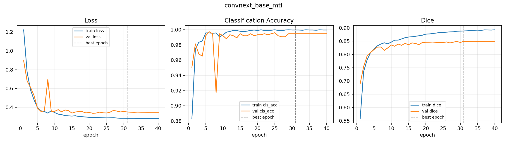
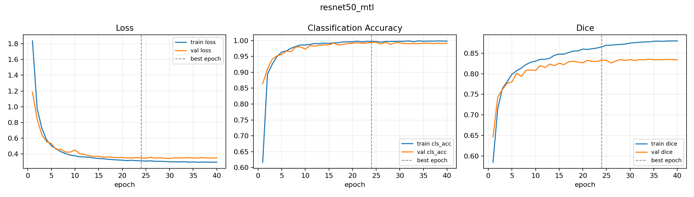

# Training History Analysis

| run | epochs | best epoch | best score | best val cls | best val dice | best cls gap | best dice gap | final score | final dice gap |
| --- | --- | --- | --- | --- | --- | --- | --- | --- | --- |
| convnext_base_mtl | 40 | 31 | 0.9223 | 0.9947 | 0.8498 | 0.0049 | 0.0390 | 0.9214 | 0.0447 |
| convnext_tiny_mtl | 40 | 35 | 0.9233 | 0.9973 | 0.8493 | 0.0022 | 0.0366 | 0.9230 | 0.0392 |
| resnet50_mtl | 40 | 24 | 0.9140 | 0.9947 | 0.8333 | 0.0027 | 0.0322 | 0.9129 | 0.0461 |

Gap values are train metric minus validation metric. Larger positive Dice gaps indicate more segmentation overfitting risk.

## Curves

