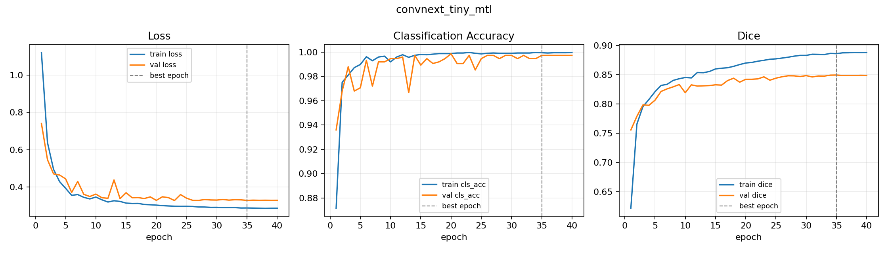
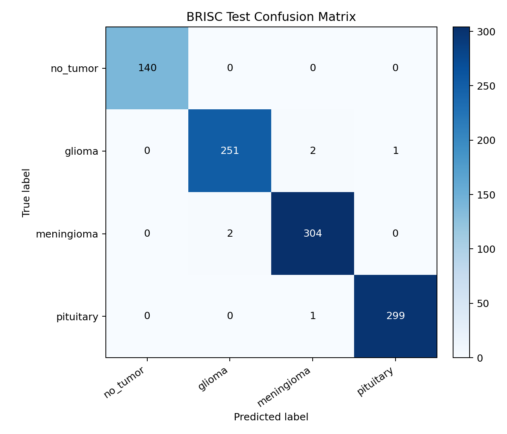
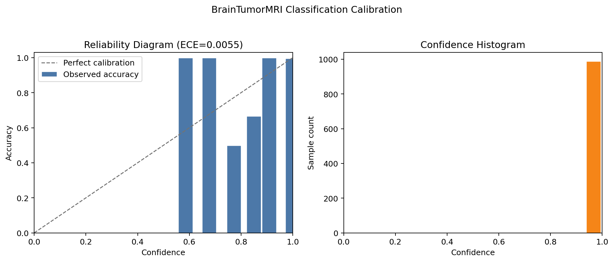
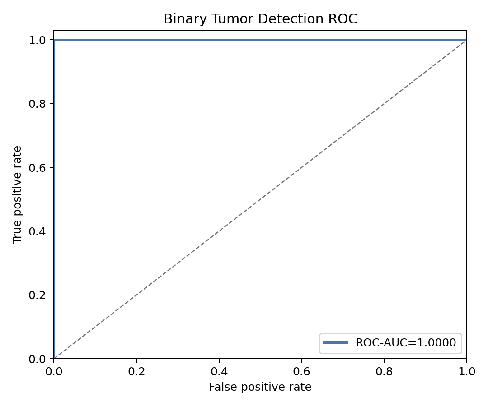
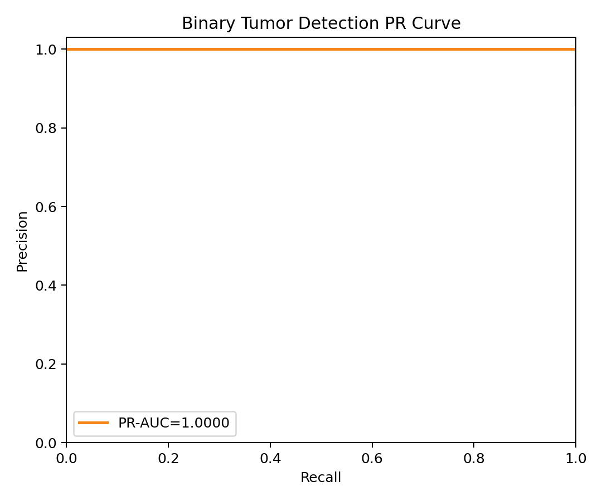
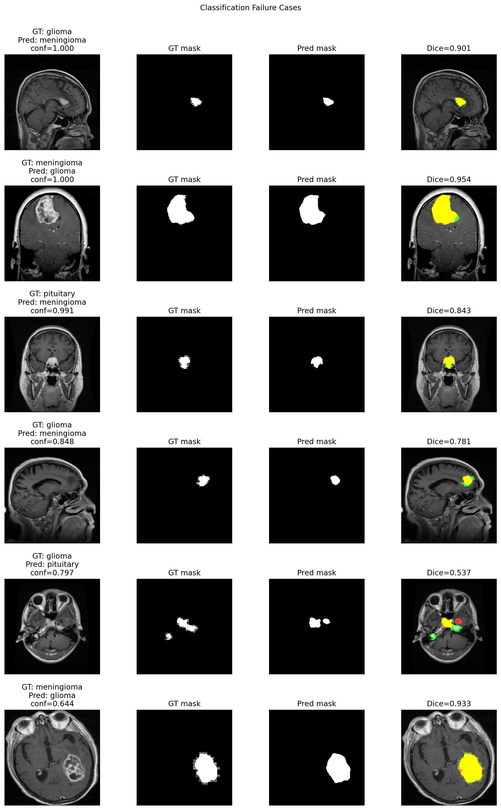
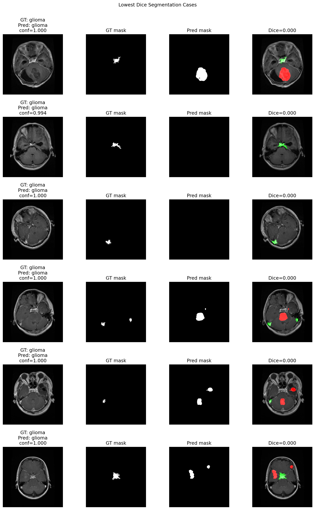

# BrainTumorMRI Analysis Report

## 1. Task Definition

BrainTumorMRI evaluates a multitask 2D MRI model for BRISC 2025 brain tumor analysis. The model predicts:

- 4-class tumor type: `no_tumor`, `glioma`, `meningioma`, `pituitary`
- binary tumor detection: tumor vs no tumor, derived from the classification head
- tumor segmentation: binary pixel mask from the segmentation decoder

The system is a research prototype only and is not intended for clinical diagnosis.

## 2. Dataset

The dataset is BRISC 2025 from Kaggle. This repository uses the segmentation task images as the primary sample
source because those samples provide both an image-level tumor class and a pixel-wise tumor mask.

The current test evaluation uses 1,000 official test samples:

| class | support |
| --- | ---: |
| no_tumor | 140 |
| glioma | 254 |
| meningioma | 306 |
| pituitary | 300 |

## 3. Method

The current best practical model is `convnext_tiny_mtl`: a shared ConvNeXt-Tiny encoder with a classification head
and a U-Net style segmentation decoder. The classification head provides both 4-class tumor type prediction and
binary tumor detection. The segmentation head predicts a binary tumor mask with a fixed threshold of 0.5 at
evaluation time.

Model comparison results are summarized in [model_comparison.md](model_comparison.md). Multi-seed stability for
ConvNeXt-Tiny is summarized in [multiseed_convnext_tiny.md](multiseed_convnext_tiny.md).

## 4. Training Setup

The headline checkpoint was trained from [configs/convnext_tiny_mtl.yaml](../configs/convnext_tiny_mtl.yaml) for up
to 40 epochs with early checkpoint selection by validation score:

```text
validation score = 0.5 * classification accuracy + 0.5 * Dice
```

The best epoch for the headline run was epoch 35. Training curves are available below.



## 5. Evaluation Metrics

The evaluation reports classification, detection, calibration, and segmentation metrics:

- classification: accuracy, macro F1, weighted F1, per-class precision/recall/F1, confusion matrix
- binary detection: accuracy, sensitivity, specificity, precision, recall, F1, balanced accuracy, ROC-AUC, PR-AUC
- calibration: expected calibration error (ECE)
- segmentation: Dice, IoU, precision, recall

## 6. Main Results

Headline checkpoint: `outputs/convnext_tiny_mtl/best.pt`

Evaluation command:

```bash
CUDA_VISIBLE_DEVICES=0 python -m brain_tumor_mri.evaluate \
  --checkpoint outputs/convnext_tiny_mtl/best.pt \
  --device cuda
```

| Metric | Value |
| --- | ---: |
| Classification Accuracy | 0.9940 |
| Macro F1 | 0.9947 |
| Weighted F1 | 0.9940 |
| Binary Detection Accuracy | 1.0000 |
| Sensitivity | 1.0000 |
| Specificity | 1.0000 |
| Binary Precision | 1.0000 |
| Binary Recall | 1.0000 |
| Binary F1 | 1.0000 |
| Balanced Accuracy | 1.0000 |
| ROC-AUC | 1.0000 |
| PR-AUC | 1.0000 |
| Dice | 0.8387 |
| IoU | 0.7814 |
| Segmentation Precision | 0.8932 |
| Segmentation Recall | 0.8619 |
| ECE | 0.0055 |

Confusion matrix:



Per-class results:

| Class | Precision | Recall | F1 | Support |
| --- | ---: | ---: | ---: | ---: |
| no_tumor | 1.0000 | 1.0000 | 1.0000 | 140 |
| glioma | 0.9921 | 0.9882 | 0.9901 | 254 |
| meningioma | 0.9902 | 0.9935 | 0.9918 | 306 |
| pituitary | 0.9967 | 0.9967 | 0.9967 | 300 |

## 7. Qualitative Results

Qualitative predictions show original MRI, ground-truth mask, predicted mask, and overlay. In the overlay, green
marks ground truth, red marks prediction, and yellow marks overlap.


## 8. Explainability

Grad-CAM examples visualize which image regions contributed to the classification decision. These maps are qualitative
debugging aids, not clinical explanations.


## 9. Calibration Analysis

The classification head is well calibrated on the official BRISC test split, with ECE 0.0055. The reliability diagram
and confidence histogram below show most predictions concentrated at high confidence.



## 10. Threshold Analysis

Binary tumor detection threshold analysis is documented in [threshold_analysis.md](threshold_analysis.md). On this test
split, thresholds 0.3 and 0.5 both preserve 1.0000 sensitivity and 1.0000 specificity; threshold 0.7 reduces
sensitivity to 0.9988 while keeping specificity at 1.0000.





## 11. Failure Cases

The remaining classification errors are concentrated between glioma and meningioma, with one pituitary case
predicted as meningioma. The segmentation score is lower than classification performance, so boundary quality and
small tumor coverage should be reviewed manually before presenting the model as a segmentation-focused system.

Classification failure examples:



Lowest Dice segmentation examples:



## 12. Limitations

- The report uses a single official test split; external validation is still missing.
- The current model is 2D slice-based and does not use volumetric MRI context.
- The binary detection metrics are derived from the 4-class classification head rather than a separately calibrated
  clinical operating threshold.
- The demo and model outputs are for research only, not diagnosis.

## 13. Future Work

- Repeat the main experiment with more seeds and report mean plus standard deviation.
- Evaluate on an external dataset or held-out institution split if available.
